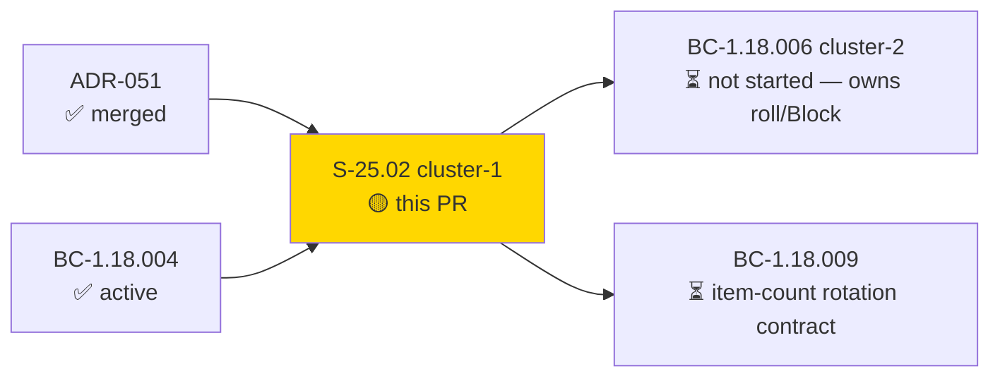
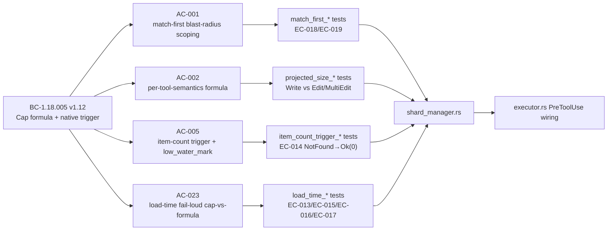
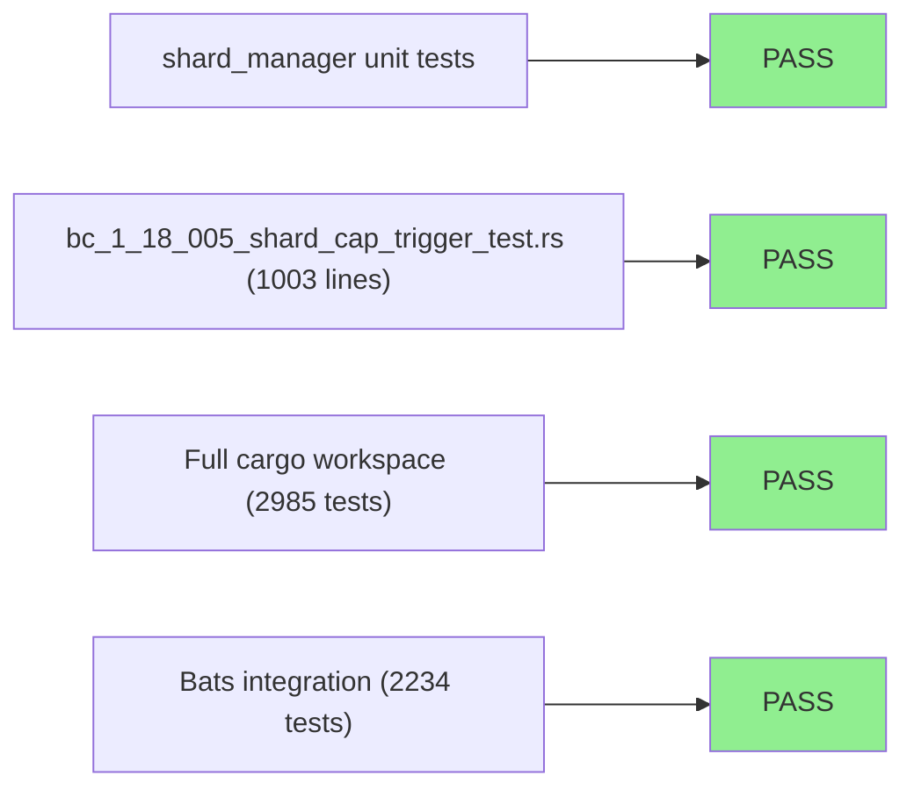

# [S-25.02] Artifact Sharding Layer 2 — Cluster 1: Cap Formula + Native Size/Item-Count Trigger

**Epic:** S-25.02 — Artifact Sharding Layer 2 (BC-1.18.001..012)
**Mode:** feature (Feature Mode F4, cycle `v1.0-brownfield-backfill`)
**Convergence:** CONVERGED at BC-5.39.001 3-CLEAN (LOCAL adversary passes 10/11/12, D-1172) after 12 cluster-1 LOCAL adversarial passes total


This PR delivers cluster 1 of the incremental-by-BC-cluster delivery of S-25.02 (per D-1170): the
native (non-WASM) dispatcher PreToolUse **shard-cap GATE + TRIGGER** for **BC-1.18.005**. It adds
`crates/factory-dispatcher/src/shard_manager.rs`, computing a `shard_cap_bytes` ceiling from four
calibrated config inputs, dispatching on artifact `shape` to either a `stat()`-only flat byte-size
trigger or an item-count trigger for the `"frontmatter-changelog-array"` shape, and wiring the
match-first `ShardRegistry::load()` (structural-parse-only) + pure `validate_entry` gate into
`executor.rs`'s PreToolUse path with fail-loud block-reason surfacing for load-time config defects
(EC-009/EC-011/EC-013/EC-015/EC-016/EC-017) and graceful missing-file degradation (EC-004/EC-014).

**Cluster boundary (explicit, spec-recorded — not a gap):** this cluster owns the cap-formula and
the trigger-BOUNDARY decision only. The *observable* roll-before-write + `HookResult::Block` action
is owned by **BC-1.18.006** (cluster 2, not yet in scope). Today, a fired byte-size trigger on the
`"flat"` shape surfaces as `tracing::warn!` + `Continue` — an honest interim, not silent
swallowing (BC-1.18.005 Postcondition 3, "Ownership" text).

---

## Architecture Changes

```mermaid
graph TD
    PreToolUse["executor.rs::PreToolUse dispatch"] -->|Edit/Write/MultiEdit| ShardGate["shard_cap_precheck()"]
    ShardGate -->|config exists?| ConfigProbe["Path::exists() shard-config.toml (O(1), fuel-free)"]
    ConfigProbe -->|no| Continue1["Continue (zero-cost bypass)"]
    ConfigProbe -->|yes| Registry["ShardRegistry::load() — structural TOML parse ONLY"]
    Registry -->|match?| Match["find_matching_entry(target_path)"]
    Match -->|None| Continue2["Continue — NO validate_entry call (match-first, v1.12)"]
    Match -->|Some(entry)| Validate["validate_entry(entry) — semantic checks EC-009/011/013/015/016/017"]
    Validate -->|invalid| BlockErr["HookResult::Error — fail-loud block_reason"]
    Validate -->|valid| GateCheck["shard_cap_gate_check() — shape dispatch"]
    GateCheck -->|shape=flat| FlatTrigger["stat()-only projected_size formula (PC3)"]
    GateCheck -->|shape=frontmatter-changelog-array| ItemTrigger["item-count trigger: current_item_count+1 > N"]
    FlatTrigger -->|over cap| Warn["tracing::warn! + Continue (roll deferred to BC-1.18.006)"]
    FlatTrigger -->|under cap| Continue3["Continue"]
    ItemTrigger -->|over N| Warn
    ItemTrigger -->|under N| Continue3
    style ShardGate fill:#90EE90
    style Registry fill:#90EE90
    style Validate fill:#90EE90
    style GateCheck fill:#90EE90
```

<details>
<summary><strong>Architecture Decision Record — match-first entry validation (BC-1.18.005 v1.12)</strong></summary>

### ADR: Match-first (not eager-fail-fast) `[[shard]]` entry validation

**Context:** `ShardRegistry::load()` originally validated every `[[shard]]` config entry eagerly on
every dispatch whose config file existed — a single malformed sibling entry would block *every*
`Edit`/`Write`/`MultiEdit` in the repo, including edits to unrelated files (LOCAL adversary
cluster-1 pass-6 finding F-C1-P6-001).

**Decision:** `find_matching_entry` runs first (structural parse only); `validate_entry` runs
*only* against the entry the current dispatch's target path actually matches. An unmatched or
differently-matched dispatch returns `Continue` even when a sibling entry is malformed.

**Rationale:** Postcondition 1's own "no arithmetic for unmatched paths" guarantee already implied
this; blast radius from one config typo should not extend to unrelated files. Blast-radius
containment is this BC's own purpose.

**Alternatives Considered:**
1. Eager fail-fast (validate every entry, every dispatch) — rejected: violates the zero-cost
   bypass promise and inverts the BC's fuel-exhaustion-prevention purpose into a cascading-failure
   vector.

**Consequences:**
- A single malformed sibling entry no longer blocks unrelated dispatches (EC-018).
- Whole-file structural TOML parse failure remains a residual, unavoidable whole-file exception
  (EC-019) — inherent to TOML's grammar, not a design choice.

</details>

---

## Story Dependencies



---

## Spec Traceability



---

## Test Evidence

### Coverage Summary

| Metric | Value | Threshold | Status |
|--------|-------|-----------|--------|
| Cargo workspace tests | 2985/2985 pass | 100% | PASS |
| Bats integration suite | 2234/2234 pass | 100% | PASS |
| `cargo fmt --check --all` | clean | clean | PASS |
| `cargo clippy --workspace --all-targets -- -D warnings` | clean | 0 warnings | PASS |
| Parallel stability | confirmed stable | stable | PASS |

### Test Flow



| Metric | Value |
|--------|-------|
| **New source module** | `crates/factory-dispatcher/src/shard_manager.rs` (2,889 lines) |
| **New integration test file** | `crates/factory-dispatcher/tests/bc_1_18_005_shard_cap_trigger_test.rs` (1,003 lines) |
| **Executor wiring diff** | `executor.rs` +195/-lines (PreToolUse-scoped only, per F-C1-P2-004) |
| **Total suite** | 2985 cargo tests + 2234 bats, all PASS |
| **Regressions** | 0 |

<details>
<summary><strong>Detailed Test Coverage by Acceptance Criterion</strong></summary>

| AC | Coverage | Edge Cases |
|----|----------|-----------|
| AC-001 | Match-first blast-radius scoping — malformed sibling entry does not block unmatched/differently-matched dispatch | EC-018, EC-019 |
| AC-002 | Per-tool-semantics projected-size formula (`Write` = `len(content)`; `Edit`/`MultiEdit` = `current + net_delta`) | EC-005 |
| AC-003 | Cross-Validator Minimum Rule (`effective_shard_cap_bytes` config-authoring helper) | — |
| AC-004 | Cap-formula constants sourced from config, not hardcoded | — |
| AC-005 | Item-count trigger for `"frontmatter-changelog-array"` shape + `low_water_mark` | EC-008, EC-010, EC-011, EC-012, EC-014, EC-016 |
| AC-023 | Load-time fail-loud cap-vs-formula inequality enforcement | EC-013, EC-015, EC-017 |

</details>

---

## Holdout Evaluation

N/A — evaluated at wave gate (Feature Mode F4 does not run a per-cluster holdout pass; deferred to
the next wave-boundary gate per feature-mode-scoping-rules).

---

## Adversarial Review

| Pass | Scope | Findings | Status |
|------|-------|----------|--------|
| 1-9 | LOCAL adversary, cluster-1 cap-trigger diff | Multiple HIGH/MEDIUM/LOW (see cycle burst-log) | All fixed |
| 10 | LOCAL adversary | 0 findings | CLEAN (1/3) |
| 11 | LOCAL adversary | 0 findings | CLEAN (2/3) |
| 12 | LOCAL adversary | 0 findings | CLEAN (3/3) — **3-CLEAN CONVERGED (D-1172)** |

**Convergence:** BC-5.39.001 3-CLEAN protocol satisfied at LOCAL adversarial cascade before PR
creation. PR-LEVEL cascade (fresh-eyes `pr-reviewer` + `code-reviewer`) runs as part of this PR's
own review convergence loop below.

<details>
<summary><strong>Representative fixed findings across the LOCAL cascade</strong></summary>

- **F-C1-P6-001 (LOW, pending-intent):** eager whole-config validation gave every malformed sibling
  entry repo-wide blast radius → fixed via match-first restructure (`validate_entry` split,
  BC v1.12).
- **F-C1-P4-001/EC-015:** non-finite/non-positive `worst_case_fuel_per_byte` divisor-door bypass →
  fixed with load-time finiteness/positivity guard.
- **F-C1-P5/EC-017:** residual saturated-ceiling divisor-door closure → fixed with raw pre-cast
  division finiteness check before the cap-vs-formula comparison.
- **F-P2-002 (HIGH):** withdrawn uniform `current_shard_bytes + payload_bytes` formula was unsound
  for `Write` (double-counted pre-existing bytes) → corrected to per-tool-semantics formula.
- **F-C1-P3-001/EC-014:** missing-file first-write case on the item-count shape propagated a bare
  `io::Error` instead of graceful `NotFound → Ok(0)` → fixed to mirror EC-004's flat-shape
  precedent.

</details>

---

## Security Review

_Populated after Step 4 (security-reviewer dispatch) — see below._

---

## Risk Assessment & Deployment

### Blast Radius
- **Systems affected:** `factory-dispatcher` binary's PreToolUse hook path only (native code, no
  WASM plugin). No changes to any WASM hook plugin, no changes to `hooks-registry.toml`.
- **User impact if this trigger misfires:** worst case today is a `tracing::warn!` log line
  (non-blocking) on the flat shape, or a fail-loud `HookResult::Error` block on a genuinely
  malformed `[[shard]]` config entry the current dispatch targets — scoped to that one artifact's
  edits only (match-first, v1.12). No roll/rotation/write-blocking behavior exists yet in this
  cluster (owned by BC-1.18.006).
- **Data impact:** none — this cluster reads config + `stat()`s target files; it performs no
  mutation of any tracked artifact.
- **Risk Level:** LOW — the gate is additive, PreToolUse-scoped, zero-cost-bypass for the ~99% of
  dispatches that don't match a `[[shard]]` entry, and has no live `[[shard]]` config committed yet
  (the F4 calibration harness that produces locked constants and the first real config entries is
  a separate, later step per BC-1.18.005 Postcondition 7).

### Performance Impact
| Metric | Before | After | Delta | Status |
|--------|--------|-------|-------|--------|
| Unmatched-path dispatch latency | baseline | baseline + O(1) `Path::exists()` probe | negligible | OK |
| Matched-path dispatch latency | n/a (new capability) | `stat()` call + native arithmetic (flat) or bounded frontmatter parse (item-count, steady state) | new, bounded | OK |

<details>
<summary><strong>Rollback Instructions</strong></summary>

**Immediate rollback:**
```bash
git revert <squash-merge-commit-sha>
git push origin develop
```

No feature flag exists for this gate — it is inert (zero-cost bypass) until a `[[shard]]` config
file is committed, which has not happened in this cluster. Rollback is a plain revert.

</details>

---

## Traceability

| Requirement | Story AC | Test | Status |
|-------------|---------|------|--------|
| BC-1.18.005 PC1 / Invariant 3 / EC-018 / EC-019 | AC-001 | match-first Red Gate suite (`shard_manager` tests) | PASS |
| BC-1.18.005 PC3 / EC-005 | AC-002 | per-tool-semantics projected-size tests | PASS |
| BC-1.18.005 PC5 | AC-003 | `effective_shard_cap_bytes` unit tests | PASS |
| BC-1.18.005 PC6 / PC7 | AC-004 | config-driven constants tests | PASS |
| BC-1.18.005 PC8 / EC-008/010/011/012/014/016 | AC-005 | item-count trigger + `low_water_mark` tests | PASS |
| BC-1.18.005 PC9 / EC-013/015/017 | AC-023 | load-time fail-loud cap-vs-formula tests | PASS |

Full spec: `.factory/specs/behavioral-contracts/ss-01/BC-1.18.005.md` (v1.12) ·
`.factory/stories/S-25.02-artifact-sharding-layer2.md` (v2.6)

Demo evidence: `docs/demo-evidence/S-25.02/cluster-1-cap-trigger/` (5 per-AC/EC VHS clips +
README — AC-002a under-cap continue, AC-002b over-cap trigger fires, AC-023 malformed-config
fail-loud, EC-014 missing-changelog first-write, EC-018 match-first blast-radius).

---

## AI Pipeline Metadata

<details>
<summary><strong>Pipeline Details</strong></summary>

```yaml
ai-generated: true
pipeline-mode: feature
factory-cycle: v1.0-brownfield-backfill
feature-phase: F4 (delta-implementation)
pipeline-stages:
  spec-evolution: completed
  incremental-stories: completed
  delta-implementation: completed
  local-adversarial-cascade: completed (BC-5.39.001 3-CLEAN, passes 10/11/12, D-1172)
  demo-evidence: completed
  pr-level-review: in-progress
convergence-metrics:
  local-adversarial-passes: 12
  clean-streak: 3/3
cluster-scope: "cluster 1 of 2 (BC-1.18.005 cap+trigger; BC-1.18.006 roll/Block deferred to cluster 2)"
generated-at: "2026-09-06"
```

</details>

---

## Pre-Merge Checklist

- [ ] All CI status checks passing
- [ ] No critical/high security findings unresolved
- [x] Rollback procedure is a plain `git revert` (no feature flag needed — gate is inert without a
      committed `[[shard]]` config)
- [x] Demo evidence recorded per-AC/EC (5 clips + README)
- [ ] pr-reviewer + code-reviewer findings triaged to 0 blocking

---

https://claude.ai/code/session_017k5167ebmypbNgwcDXLoYh
